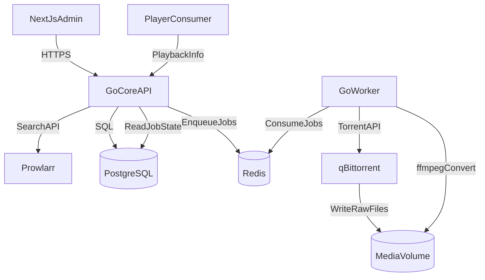

# Media Processing Admin System — System Overview

## 1) Цель и scope этапа

Система предназначена для административного поиска медиа, постановки задач на скачивание, автоматической конвертации и публикации готового файла для плеера через API.

В рамках текущего этапа:

- поддерживается только `movie` pipeline;
- deployment только на одном хосте через `docker compose`;
- хранение файлов локальное (volume), без object storage;
- горизонтальное масштабирование не закладывается как обязательное.

## 2) Архитектурный стиль

Выбран стиль **Modular Monolith + Async Workers**:

- `Go Core API` отвечает за бизнес-правила, состояние и API-контракты;
- тяжелые операции вынесены в `Go Worker`;
- связь API и Worker через очередь в `Redis`;
- persistence состояния в `PostgreSQL` как source of truth;
- поиск вынесен в отдельный indexer backend `Prowlarr` через абстракцию `IndexerProvider`.

Такой стиль упрощает запуск и эксплуатацию на single-host, но сохраняет возможность выделения модулей в отдельные сервисы.

## 3) High-level схема

## 4) Логический pipeline

1. Admin выполняет поиск в UI.
2. API делает запрос к `IndexerProvider` (backend `Prowlarr`) и сохраняет результаты в БД.
3. Admin выбирает результат и запускает скачивание.
4. API создает `download job` и публикует задачу в `Redis`.
5. Worker забирает задачу, добавляет torrent в `qBittorrent`, отслеживает прогресс.
6. По завершении скачивания Worker создает `convert job`.
7. Convert worker запускает `ffmpeg`, пишет логи и статус.
8. Готовый артефакт публикуется как `ready`, API отдает плееру метаданные и путь/stream endpoint.

## 5) Базовые архитектурные контракты

Минимальный единый контракт для job payload:

- `job_id` — уникальный идентификатор задачи;
- `content_type` — `movie` (сейчас), `series` (в будущем);
- `source_type` — тип источника (`torrent`, потенциально другие);
- `source_ref` — magnet/link/id в источнике;
- `priority` — приоритет выполнения;
- `retry_count` — число попыток;
- `correlation_id` — сквозная трассировка операции.

Минимальная state model задач:

- `created` → `queued` → `in_progress` → `completed`;
- ошибки: `failed` с кодом причины и признаком retryability;
- для долгих задач обязательны `progress_percent` и `updated_at`.

## 6) Нефункциональные требования

- **Надежность:** ретраи c backoff для внешних интеграций, идемпотентная обработка job.
- **Устойчивость поиска:** timeout/retry/circuit-breaker для интеграции с `Prowlarr`.
- **Наблюдаемость:** JSON-логи, health endpoints для всех контейнеров, базовые метрики API/worker.
- **Безопасность:** JWT для admin API, внутренние сервисы недоступны извне, секреты через env.
- **Эксплуатация:** restart policies, лимиты ресурсов контейнеров, централизованный просмотр логов через `docker compose logs`.

## 7) Решения по оптимизации стека

Для этапа 1 сохраняется текущий стек, но с уточнением ролей:

- `PostgreSQL` — долговременное состояние, история задач, аудит;
- `Redis` — только очередь, задержки, retry/visibility timeout;
- `Prowlarr` — backend поиска по torrent-индексаторам за интерфейсом `IndexerProvider`;
- `qBittorrent` — backend загрузки за интерфейсом `DownloadProvider`;
- `ffmpeg` — инструмент конвертации, управляется только worker-ом.

Это уменьшает связность модулей и упрощает замену компонентов в будущем (например, другой queue broker или download provider).

## 8) Точки расширения под сериалы (без реализации)

На текущем этапе фиксируются только extension points:

- `content_type` в контрактах задач и API;
- abstraction `MediaResolver` для определения final-артефакта;
- strategy-интерфейс планирования загрузки (`single item` сейчас, `episode/season` позже);
- статусная модель, допускающая агрегацию прогресса дочерних задач.

Доменная модель `Series/Season/Episode` и соответствующие сценарии скачивания не внедряются в этом этапе.
