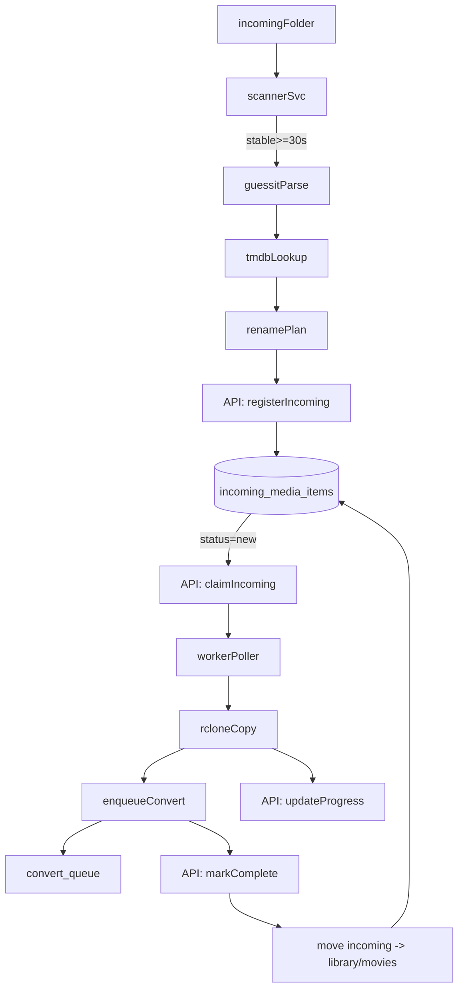
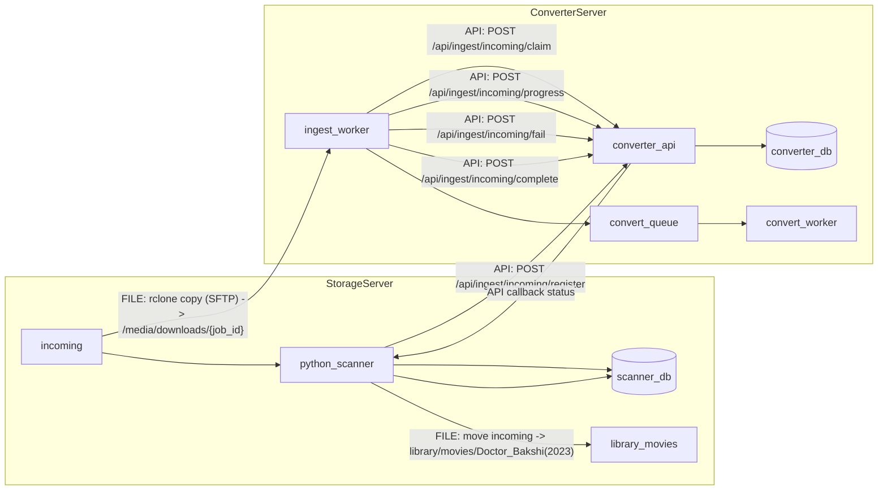

# Спецификация внедрения: scanner + worker (2 блока)

## Статус документа

- Назначение: базовая спецификация для реализации в 2 независимых блоках.

## Цель

Перевести входной поток фильмов на модель `incoming-primary-all`: любые файлы/папки складываются в `incoming`, отдельный scanner на storage-сервере индексирует и нормализует имена, а converter worker забирает задания с удаленного сервера и ведет статусы через API.

## Размещение папки incoming (явно)

- Папка `incoming` находится на отдельном сервере хранения (storage server), а не на converter server.
- Converter server не является владельцем `incoming`; он только забирает файлы удаленно по `rclone`/`SFTP`.
- Операции состояния идут по API, файловые операции - по transfer-каналу:
  - API: регистрация, claim, progress/fail/complete;
  - Transfer: `rclone copy` для забора исходника.

## Подтвержденные решения

- Источник загрузки: `incoming` становится основным входом.
- Гранулярность: каждый видеофайл внутри папки = отдельный фильм.
- Межсерверный транспорт: `rclone` по `SFTP/SSH`.
- Канал записи состояния: `API-only` (scanner и worker не пишут напрямую в Postgres).
- Логика дублей: авто-обновление только при подтвержденном улучшении качества по `ffprobe`; при неуверенности файл остается в `incoming` и переименовывается для ручной проверки.

## Общий поток

## Схема взаимодействия серверов (API и переносы)

## Блок 1 - Отдельный Python-сервис (storage server)

### Назначение

Сервис живет отдельно от текущего репозитория конвертера в своей папке/проекте, со своим `docker-compose.yml`, и отвечает только за:

- сканирование `incoming` каждые 30 сек;
- проверку стабильности размера файла (`>=30 сек без изменений`);
- GuessIt + TMDB нормализацию имени;
- организацию файлов и регистрацию новых элементов через API.

### Скоуп блока

- Новый отдельный каталог проекта scanner (вне основного `converter` репо при деплое на storage server).
- Собственный `docker-compose.yml` + `.env.example` для scanner.
- Логика имени:
  - с TMDB: `doctor_bakshi_2023_[881935]`;
  - без TMDB: fallback из GuessIt (без `_[tmdb_id]`).
- Каждый видеофайл в подкаталогах `incoming` регистрируется как отдельная сущность.
- Встроенная обработка дублей (full duplicate vs better quality) до отправки в converter.

### Политика дублей (обязательная)

- Ключ сопоставления фильма:
  - приоритет 1: `tmdb_id`;
  - fallback: нормализованный `title + year`.
- Качество определяем по `ffprobe` (основной критерий):
  - resolution (2160 > 1080 > 720),
  - HDR/DV наличие,
  - video codec (AV1/HEVC > H.264 при равном визуальном качестве),
  - bitrate как tie-breaker в пределах одного resolution/codec.
- Детализация `quality_score` (детерминированно, для автосравнения):
  - `resolution_score`: 2160p=60, 1440p=45, 1080p=35, 720p=20, SD=10;
  - `hdr_score`: DolbyVision=15, HDR10/HDR10+=10, SDR=0;
  - `codec_score`: AV1=10, HEVC=8, H264=5, MPEG2/other=2;
  - `bitrate_score`: 0..15 (линейно в рамках текущего resolution tier, cap по percentile);
  - `quality_score = resolution_score + hdr_score + codec_score + bitrate_score`.
- Порог авто-апгрейда:
  - апгрейд разрешен только если `new_score >= old_score + 8`;
  - если разница `< 8`, статус `review` (без авто-замены).
- `GuessIt` используется только как предварительный hint (не финальное решение).
- Правило вычисления `quality_label` (приоритетно для каталога):
  - если релиз определен как `WEBRip` или `HD` -> `quality_label='HD'`;
  - если релиз определен как `экранка` (`CAM|TS|TC|Screener`) -> `quality_label='SD'`;
  - если тип релиза не распознан -> `quality_label` не заполняется (`NULL`).
- Действия:
  - если файл **лучше текущего** -> статус `upgrade_candidate`, отправка в converter (замена существующего master);
  - если **полный дубль** -> оставить в `incoming` и переименовать в `REVIEW_DUPLICATE_<movie_key>_<timestamp>.<ext>`;
  - если **качество не определено уверенно** -> оставить в `incoming` и переименовать по тому же review-шаблону.

### API-контракт для scanner (нужен в converter API)

- `POST /api/ingest/incoming/register` - idempotent регистрация стабильного файла.
- `POST /api/ingest/incoming/heartbeat` - при необходимости обновление last-seen/size.
- Auth: отдельный service token для scanner.

### БД scanner: таблицы, назначение и поля

Финальная упрощенная схема scanner DB состоит из 2 таблиц.

#### 1) `scanner_library_movies` (главный каталог готовых фильмов)

Назначение:

- Единый плоский каталог для UI/выгрузок/скачиваний.
- Содержит все данные о фильме и расположение в `library`.
- Это основная таблица, где вы видите что уже готово и доступно.

Ключевые поля:

- `id` (PK)
- `content_kind` (`movie|series`, на текущем этапе `movie`)
- `title` (каноническое название)
- `title_original` (как было распознано/загружено)
- `normalized_name` (например `doctor_bakshi_2023_[881935]`)
- `year`
- `tmdb_id` (nullable)
- `imdb_id` (nullable)
- `poster_url` (nullable)
- `quality_score`
- `quality_label` (`HD|SD`)
- `library_relative_path` (например `movies/Doctor_Bakshi(2023)/Doctor_Bakshi(2023).mkv`)
- `file_size_bytes`
- `status` (`ready|replaced|deprecated`)
- `source_item_id` (FK -> `scanner_incoming_items.id`)
- `created_at`, `updated_at`

Индексы/ограничения:

- `UNIQUE (tmdb_id)` где `tmdb_id IS NOT NULL` для канонического сопоставления.
- `UNIQUE (normalized_name)` как fallback при отсутствии TMDB.
- индекс `(status, updated_at DESC)` для выборок каталога.
- check-constraint: `quality_label IN ('HD','SD')`.
- источник `quality_label`: классификация типа релиза (`WEBRip/HD => HD`, `CAM/TS/TC/Screener => SD`).

#### 2) `scanner_incoming_items` (минимальная операционная очередь)

Назначение:

- Отслеживает только жизненный цикл файлов в `incoming` до перемещения в `library`.
- Держит минимум операционных полей (без избыточного audit-слоя).

Ключевые поля:

- `id` (PK)
- `source_path` (путь в `incoming`)
- `source_filename`
- `file_size_bytes`
- `first_seen_at`, `last_seen_at`, `stable_since`
- `status` (`new|registered|claimed|copying|copied|completed|archived|failed|review_duplicate|review_unknown_quality|skipped`)
- `review_reason` (`full_duplicate|unknown_quality|metadata_conflict|move_failed|...`)
- `duplicate_of_library_movie_id` (FK -> `scanner_library_movies.id`, nullable)
- `is_upgrade_candidate` (bool)
- `quality_score` (nullable до ffprobe)
- `api_item_id` (id записи на стороне converter, nullable)
- `error_message` (nullable)
- `library_relative_path` (nullable, заполняется при успешном move)
- `created_at`, `updated_at`

Индексы/ограничения:

- `UNIQUE (source_path)` для идемпотентности сканирования.
- индекс `(status, stable_since)` для обработки очереди.
- индекс `(duplicate_of_library_movie_id, status)` для дублей/апгрейдов.

Примечание:

- Абсолютный URL скачивания в scanner DB не хранится.
- Для выдачи ссылки используется `library_relative_path` + `base_url` из конфигурации API/дистрибуции.

## Блок 2 - Доработка worker-converter (remote pull + API statuses)

### Назначение

Воркер на стороне конвертера не сканирует папку напрямую. Он получает задания через API claim, скачивает исходник с storage-сервера (`rclone` SFTP), запускает существующий convert pipeline и обновляет статусы через API.

### Скоуп блока

1. Worker получает unit of work через API:
  - `POST /api/ingest/incoming/claim`
2. Worker копирует файл с удаленного storage:
  - `rclone copy sourceRemote:incoming/... /media/downloads/{job_id}/...`
3. Worker отдает прогресс/ошибки через API:
  - `POST /api/ingest/incoming/progress`
  - `POST /api/ingest/incoming/fail`
4. После постановки в `convert_queue` и успешной фиксации:
  - `POST /api/ingest/incoming/complete` (API переводит в `completed` и инициирует/подтверждает перенос `incoming -> library/movies`).
5. Параллельность обработки:
  - воркер делает claim батчами (`claim_limit`, default 10),
  - исполняет с ограничением `INGEST_CONCURRENCY` (default 3),
  - каждый item из батча обрабатывается независимо с own retry и status updates.

## Модель данных (в converter API/DB)

Добавить таблицу `incoming_media_items` (новая миграция) как отдельный контур ingestion, не ломая текущие `media_jobs`/queue-контракты.

- `status`: `new`, `claimed`, `copying`, `copied`, `completed`, `failed`, `skipped`
- `content_kind`: `movie` сейчас, `series` зарезервировано
- уникальный индекс: `source_path`
- рабочий индекс: `(status, stable_since)`
- поля для дублей: `duplicate_of_movie_id`, `quality_score`, `quality_confidence`, `is_upgrade_candidate`, `review_reason`

## Итоговый state flow

- Базовый путь:
  - `new -> claimed -> copying -> copied -> completed -> archived`
- Ошибки:
  - `copying -> failed` (retry policy),
  - `claimed -> failed` (claim timeout / lease expired),
  - `new -> skipped` (неподдерживаемый тип/правила контента).
- Дубли:
  - `new -> review_duplicate` (полный дубль),
  - `new -> review_unknown_quality` (качество не определено),
  - `new -> upgrade_candidate -> claimed` (подтвержденный апгрейд).

## Перенос после обработки (scanner-side)

- Перенос в `library/movies/...` выполняет scanner (storage-side mover), а не converter worker.
- Точка запуска переноса: callback от converter API о статусе `copied|completed`.
- Формат целевой папки:
  - `library/movies/Doctor_Bakshi(2023)/`
- Если перенос не удался:
  - сохранить `review_reason=move_failed`,
  - оставить файл в `incoming`,
  - не переводить в финальный `archived` до успешного повтора.

## Изменения в текущем converter репо

- API:
  - новые ingest endpoints для scanner/worker (service-to-service auth).
- Worker:
  - новый ingest-puller модуль (claim via API + rclone copy + status callbacks).
  - интеграция в `worker/cmd/worker/main.go`.
- DB:
  - миграция `incoming_media_items`.
- Документация:
  - `CHANGELOG.md`, `docs/roadmap/roadmap.md`, `docs/contracts/worker.md`, `docs/converter/pipeline.md`, ADR.

## Тестирование и валидация

- Scanner unit tests (парсинг стабильности, нормализация имени, fallback без TMDB).
- Scanner tests для дублей:
  - better-quality апгрейд проходит в конвертацию,
  - full duplicate не уходит в конвертацию и переименовывается в review-формат,
  - unknown-quality не уходит в конвертацию и переименовывается в review-формат.
- API endpoint tests (idempotency register/claim/progress/complete).
- Worker unit/integration tests (API claim flow, переходы статусов, rclone error handling).
- E2E smoke между двумя средами: storage scanner compose + converter stack.
- Проверка обратной совместимости текущего convert pipeline.

## Документационные и архитектурные обязательства

- Обновить `CHANGELOG.md` под `## [Unreleased]`.
- Добавить ADR (разделение scanner/worker и API-only статусный контур): через `./scripts/new-adr.sh "incoming scanner api-driven ingest split"`.
- Обновить `docs/roadmap/roadmap.md` (новая выполненная/добавленная работа).
- Синхронизировать контракты/пайплайн (`docs/contracts/worker.md`, `docs/converter/pipeline.md`).

## Порядок реализации (итерации)

1. Блок 1: scaffold отдельного scanner-проекта и compose, затем scan/stability/GuessIt/TMDB, затем API register.
2. Блок 2: ingest API endpoints + миграция, затем worker API-claim/pull/progress/finalize.
3. Интеграция: convert handoff, перенос в `library/movies`, retry semantics.
4. Документация, ADR, changelog, roadmap, e2e smoke.

## Критерии готовности спецификации

- Архитектура зафиксирована в 2 блоках и согласована.
- API-only контур статусов зафиксирован.
- Политика дублей и quality scoring формализованы.
- Batch + concurrency политика воркера зафиксирована.
- Путь перемещения `incoming -> library/movies/...` закреплен за scanner.
